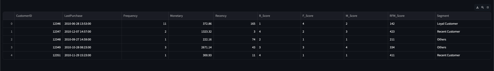
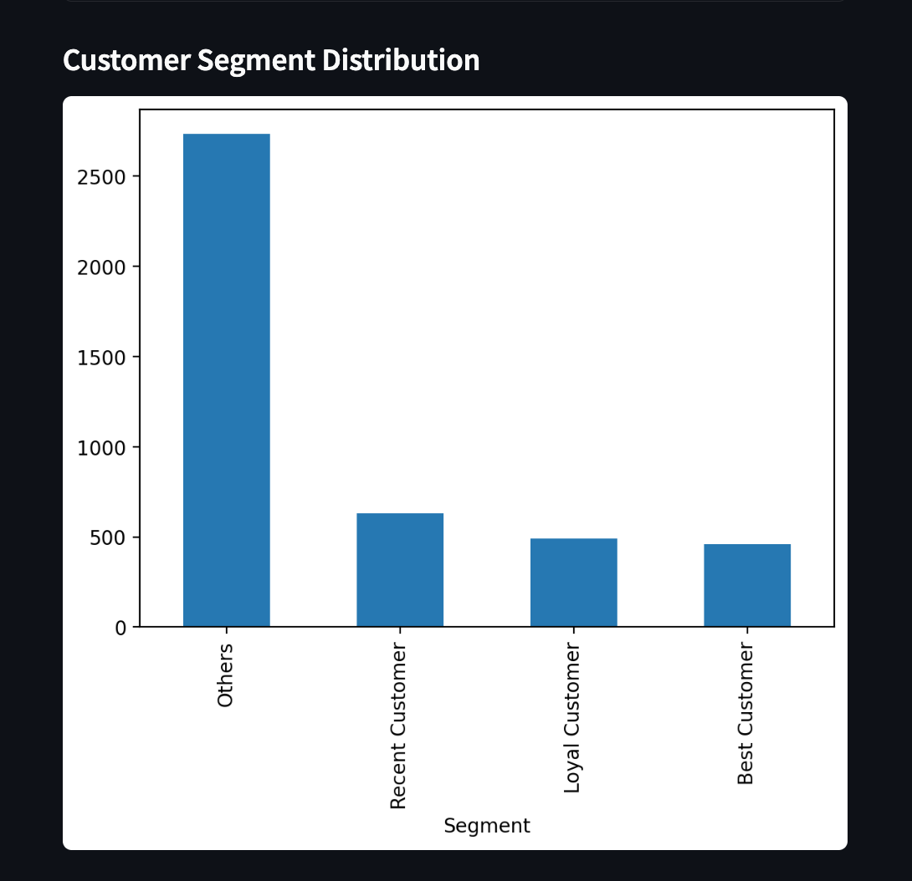
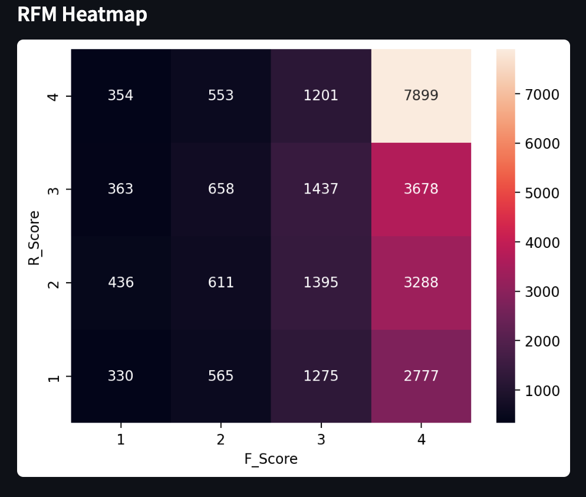

# Customer Segmentation using RFM Analysis

## Project Overview

This project performs customer segmentation using RFM (Recency, Frequency, Monetary) analysis on a real e-commerce transactional dataset. The objective is to identify high-value, loyal, and inactive customers based on their purchasing behavior.

The project combines SQL for data aggregation and Python for analysis and visualization.

---

## Tools Used

- Python
- SQLite
- Pandas
- Matplotlib
- Seaborn
- Streamlit

---

## Project Structure

customer_segmentation_project/

data/  
 online_retail_II.xlsx

database/  
 retail.db

create_db.py  
analysis.py  
dashboard.py  
README.md

---

## Workflow

1. Data Cleaning
   - Removed missing Customer IDs
   - Filtered cancelled invoices
   - Removed negative quantities

2. SQL Aggregation
   - Used GROUP BY to compute customer-level metrics
   - MAX(InvoiceDate) for recency
   - COUNT(DISTINCT Invoice) for frequency
   - SUM(TotalPrice) for monetary value

3. RFM Scoring
   - Applied quantile-based scoring using pandas

4. Customer Segmentation
   - Classified customers into different segments

5. Visualization
   - Segment distribution
   - RFM heatmap
   - Revenue analysis

6. Dashboard
   - Built an interactive dashboard using Streamlit

---

## Main Dashboard

## Customer Segment Distribution

## RFM Heatmap

## How to Run

Install dependencies:

pip install pandas matplotlib seaborn streamlit openpyxl

Create database:

python create_db.py

Run analysis:

python analysis.py

Launch dashboard:

streamlit run dashboard.py

---

## Skills Demonstrated

- SQL querying and aggregation
- Data cleaning and preprocessing
- Feature engineering
- Business analytics
- Data visualization
- Dashboard development
